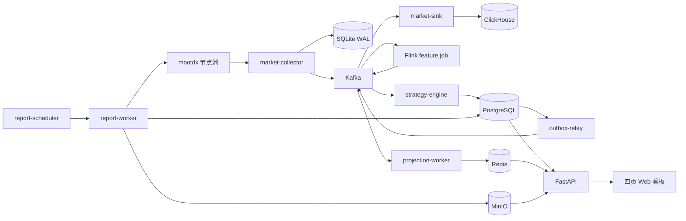
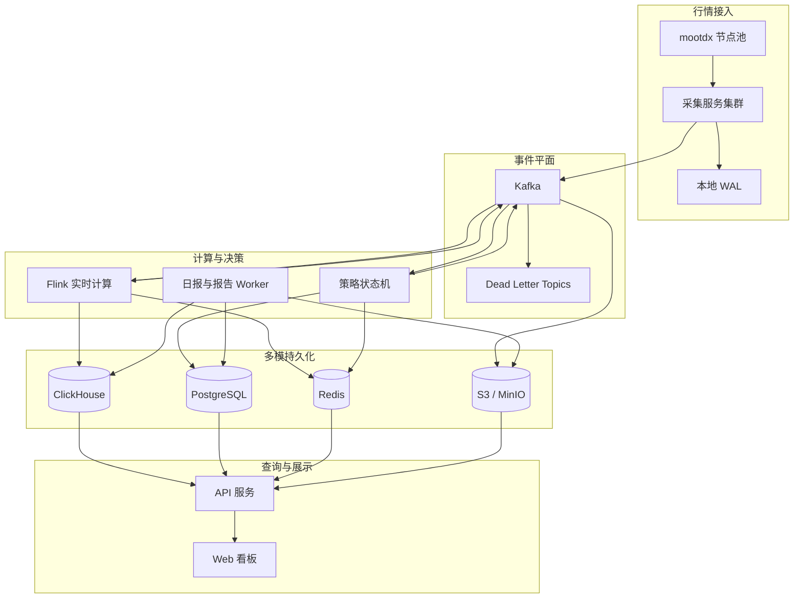

# 系统架构设计

## 1. 架构原则

1. `mootdx` 是唯一行情源，但其多个通达信节点可作为连接故障切换目标。
2. Kafka 是所有实时事件的唯一入口，服务之间不通过共享内存传递权威数据。
3. Flink 只计算事实和衍生指标，最终策略状态由独立策略引擎维护。
4. PostgreSQL、ClickHouse 和对象存储是权威持久层，Redis 仅提供可重建投影。
5. 投递语义为“至少一次 + 幂等写入”，不承诺不可验证的端到端 exactly-once。
6. 数据异常时优先停止判断，不使用旧行情继续生成入场确认。
7. 系统不包含自动下单、券商账户和持仓资金操作。

## 2. CURRENT 架构

当前版本已经拆分为可独立运行的 Python 服务，并在本地 Compose 中接入完整数据链路：

已实现能力：

- mootdx 长连接、批量盘口、1 秒交易时段轮询、60 秒分钟线和节点切换。
- SQLite 持久 WAL、Kafka Topic/DLQ、ClickHouse Sink、Flink 特征和 Redis 投影。
- PostgreSQL Inbox/Outbox、策略状态、报告任务和多策略目录。
- 可重命名策略目录、不可变策略参数与血缘、永久删除关联数据和全局唯一激活策略。
- 16:30/23:30 调度、启动补跑、独立刷新任务及持久化完成标记。
- 月度研究、一年历史回填、严格可买执行分析、T+1 收益和盈利约束优化。
- FastAPI `/api/v1`、SSE、Prometheus 和策略管理/次日计划/盘中监控/回测优化页面。

当前限制：

- Compose 为单机开发拓扑，Kafka、PostgreSQL、ClickHouse、Redis 和 MinIO 未形成生产高可用。
- Kubernetes 清单是部署基线，尚未在目标集群完成容量、跨可用区和恢复演练。
- 历史分钟线无法证明真实委托队列成交，严格可买只是保守代理。
- 09:45 盈利优化候选样本仅 9 笔且留出集 1 笔，保持未激活。

## 3. TARGET 总体架构

横切能力：

- Prometheus：指标与告警。
- Loki：结构化日志。
- Tempo：分布式追踪。
- OpenTelemetry：统一埋点。
- Kubernetes：编排、服务发现、滚动发布和租约。

## 4. 组件职责

### 4.1 采集服务

- 根据动态监控清单对股票分片。
- 每个分片由一个 Leader 采集，备用实例通过租约接管。
- 复用 mootdx 连接并维护节点健康分数。
- 盘口目标周期 1 秒，分钟线目标周期 60 秒。
- 事件发布前写本地 RocksDB WAL；Kafka 确认后推进 WAL Checkpoint。
- 生成稳定 `event_id`，记录 `source_time`、`collected_at` 和 `published_at`。

采集器不执行策略判断，避免行情接入和业务规则耦合。

### 4.2 Kafka

- 原始行情、衍生指标、策略决策和审计事件的统一总线。
- 按 `symbol` 作为分区键，保证单只股票事件有序。
- 生产者启用幂等和 `acks=all`。
- 消费者写入权威存储后提交 offset。
- Schema 不兼容或无法解析的数据进入对应 DLQ。

Topic 设计见 [数据与存储](03-data-storage.md)，消息契约见
[AsyncAPI](asyncapi.yaml)。

### 4.3 Flink

负责：

- 一分钟和多分钟滚动窗口。
- 分钟量比、价格区间、数据延迟和异常检测。
- 题材上涨家数比例、涨停家数和板块强度。
- Checkpoint 和从 Kafka 重放恢复。

不负责：

- 最终“入场/放弃”业务状态。
- 策略版本和人工配置管理。
- 报告文件生成。

Flink 输出进入新的 Kafka Topic，再由策略引擎和存储 Sink 消费。

### 4.4 策略状态机

- 同时消费原始行情、Flink 衍生指标和所有有效策略计划。
- 每个计划使用独立处理器，按 `plan_id + symbol` 维护状态；同一行情可驱动多份计划。
- 将输入事件登记到 `inbox_event`，防止重复消费。
- 在一个 PostgreSQL 事务内更新当前状态、追加决策事件并写入 Outbox。
- Outbox Relay 将决策可靠发布到 Kafka。
- Redis Consumer 根据决策事件更新实时查询投影。

状态机必须保存不可逆规则，例如跌破昨收、开盘超限和 10:00 窗口关闭。

### 4.5 策略目录与逐日投影

- `strategy_definition.name` 是可修正的展示元数据，`current_config` 保存不可变完整参数。
- 新策略记录 `parent_strategy_id` 与逐项 `config_changes`；参数修改通过创建子策略完成。
- PostgreSQL 部分唯一索引保证全库最多一条未归档激活策略。
- `strategy_day` 按 `(strategy_id, trade_date)` 保存 `next_plan`、`execution_plan` 和 `actuals`。
- 调度、刷新和默认监控在执行开始时解析当前激活策略，避免队列固化旧配置。
- 永久删除在 PostgreSQL 事务内移除策略定义及其策略日、运行、计划、候选、决策和精确关联的研究记录，并清理 MinIO、Redis 与本地报告；共享行情不删除。
- 删除父策略时保留子策略，但将其 `parent_strategy_id` 置空，避免连带删除仍可独立运行的策略。

### 4.6 日报与报告 Worker

- Kubernetes CronJob 在交易日 16:30 生成初版，并于 23:30 发起覆盖更新。
- Worker 使用 mootdx 交易日历校验日期，非交易日正常跳过。
- PostgreSQL 唯一键 `(trade_date, strategy_version_id)` 防止同版本重复运行。
- 调度器启动时回看最近 7 天已到期时点，以本地文件和完成标记识别遗漏任务。
- 页面“刷新”创建独立任务；Worker 开始时重新读取当前激活策略并执行完整报告事务。
- 从 ClickHouse 读取历史行情和统计结果。
- 将运行状态、候选和报告元数据写入 PostgreSQL。
- 将 Markdown、JSON 和 CSV 文件写入 S3/MinIO。

### 4.7 研究服务

- 月度研究按时间顺序划分训练、验证和留出集，保存协议、输入哈希、逐日结果和源码快照。
- `catalog_backfill` 为所有未归档策略补齐历史计划、执行计划和实际行情，重复运行只补缺口。
- `execution_analysis` 用分钟线执行严格可买判定，并输出日/周/月/年统计。
- `profit_optimization` 以 T+1 开盘卖出和每笔 25bp 成本评估参数，只保存满足约束的未激活子策略。
- 研究记录与实时计划、观察清单和决策事件隔离。

### 4.8 API 与 Web

- 对外统一使用 `/api/v1`。
- 最新快照优先读取 Redis；缓存缺失时回源 PostgreSQL 或 ClickHouse。
- 历史行情和指标读取 ClickHouse。
- 策略计划、状态和审计读取 PostgreSQL。
- 报告内容通过对象存储签名地址或 API 代理访问。
- SSE 仅用于降低页面轮询开销，断线后必须能通过普通查询恢复。
- `/strategy`、`/`、`/monitor`、`/research` 共用 `ui-standard.css`，统一导航、
  控件、表格、状态和移动端布局。
- `/strategy` 无 `strategy_id` 时展示横向关键参数列表；点击名称后按
  `strategy_id` 进入记录与参数详情。

## 5. 数据流

### 5.1 盘口快照

1. 采集器从 mootdx 获取候选股票盘口快照。
2. 规范化字段并生成 `event_id`。
3. 写本地 WAL，再发布 `market.quote.snapshot.v1`。
4. ClickHouse Sink 保存历史快照。
5. Flink 计算窗口指标并发布 `market.feature.realtime.v1`。
6. 策略状态机生成状态迁移，写 PostgreSQL 和 Outbox。
7. Redis 投影更新，API 将结果推送到 Web。
8. 原始事件按批次归档为 Parquet 到 S3/MinIO。

### 5.2 一分钟线

一分钟线每 60 秒从 mootdx 刷新，不等于每 60 秒才采集一次盘口。分钟线按
`symbol + minute` 幂等更新，用于趋势、量能和行情时效校验。

### 5.3 每日策略

1. 16:30 和 23:30 到期后，调度器为当前激活策略启动完整报告事务。
2. Worker 获取交易日历、涨停池、炸板池、板块数据和历史行情。
3. 执行静态过滤、评分、行业限额和组合约束。
4. 保存候选和计划，发布 `strategy.plan.created.v1`。
5. 生成报告并写对象存储。
6. 次交易日采集器根据计划更新动态监控清单。

### 5.4 策略变更与刷新

1. 用户读取来源策略及 revision。
2. 仅修改名称时，更新原策略展示名称，不改变参数快照、血缘或历史记录。
3. 参数修改时必须输入新名称并创建子策略，数据库保存父策略和逐项差异。
4. 可选在同一流程激活子策略，事务内停用旧策略。
5. 定时任务或刷新 Worker 开始执行时读取当前激活策略。
6. 报告写入策略专属目录，并更新参考日和执行日的 `strategy_day`。

### 5.5 历史研究

1. mootdx 快照按日期冻结并计算哈希。
2. 研究按时间顺序执行训练、验证、留出，留出结果不参与选参。
3. 严格可买使用竞价、昨收、触板、有量开板和回封的分钟级代理。
4. T+1 收益扣除配置的往返成本；不可卖代理样本不计净收益。
5. 通过约束的参数保存为未激活子策略，必须人工激活后才影响后续任务。

## 6. 一致性与可靠性

### 6.1 幂等

- 原始快照：稳定 `event_id`。
- 分钟线：`symbol + bar_time`。
- 策略状态：`plan_id + symbol`。
- 状态迁移：`decision_id`，由输入事件和目标状态确定。
- 日报运行：`trade_date + strategy_version`。
- 策略日记录：`strategy_id + trade_date`。
- 策略激活：数据库部分唯一索引 + 事务级 advisory lock。
- 历史回填：只填充空字段，不覆盖已有计划和实际行情。

### 6.2 Inbox/Outbox

策略引擎不能在“数据库提交”和“Kafka offset 提交”之间依赖时间顺序碰运气：

1. 在 PostgreSQL 事务内登记 `inbox_event`。
2. 更新 `decision_state`。
3. 追加 `decision_event`。
4. 写入 `outbox_event`。
5. 事务提交后再确认消费进度。
6. Outbox Relay 独立发布事件并记录确认时间。

重复消息会命中唯一键并幂等退出。

### 6.3 降级策略

| 故障 | 行为 |
| --- | --- |
| mootdx 单节点失败 | 切换备用节点，记录数据间隙 |
| mootdx 全部节点失败 | 保留最后报价，标记失效，暂停入场判断 |
| Kafka 不可用 | 采集器写 WAL，达到容量阈值后停止接收并告警 |
| Flink 不可用 | 原始行情继续落盘，依赖衍生指标的判断暂停 |
| PostgreSQL 不可用 | 不生成新策略决策，禁止只写 Redis |
| Redis 不可用 | API 回源权威存储，允许延迟升高 |
| ClickHouse 不可用 | 实时状态继续，历史查询和报告任务降级 |
| 对象存储不可用 | 报告任务重试，不将运行标记为完整成功 |

## 7. 部署拓扑

生产目标（当前 Kubernetes 清单已提供基线，仍需目标集群验证）：

- Kubernetes 跨三个可用区。
- Kafka 3 Broker，副本数 3，`min.insync.replicas=2`。
- Flink 高可用 JobManager，Checkpoint 写 S3/MinIO。
- PostgreSQL 一主两副本或托管 Multi-AZ，启用 WAL 归档。
- ClickHouse 首期一分片两副本，三节点 Keeper。
- Redis 主从加 Sentinel，或使用托管高可用 Redis。
- API、采集器、策略引擎和 Worker 至少两个实例。

实时采集使用分片 Leader，不让多个副本重复请求同一批股票。Kafka、Flink 和数据库仍需
处理切换过程中可能出现的重复事件。

## 8. 性能与容量边界

近期生产范围：

- 日线分析覆盖沪深主板。
- 实时监控覆盖日报候选和人工补充清单，首期上限 200 只。
- 盘口快照目标 1 秒一次。
- 分钟线目标 60 秒刷新一次。

扩大到全市场 1 秒采样前，必须验证 mootdx 节点承载、网络带宽、Kafka 分区数、
ClickHouse 写入量和 Flink 状态大小，不得直接沿用候选池容量结论。

## 9. 技术选型结论

| 领域 | 选型 | 结论 |
| --- | --- | --- |
| 应用服务 | Python 3.12、FastAPI、Pydantic | 延续现有策略代码，API 使用 ASGI 多副本部署 |
| 数据访问 | SQLAlchemy、Alembic | PostgreSQL 事务和版本化迁移 |
| Kafka 客户端 | confluent-kafka-python | 使用 librdkafka 的幂等生产和消费能力 |
| 消息总线 | Kafka | 不同时维护 Pulsar |
| 流计算 | Flink SQL、PyFlink | 用于窗口和板块指标，不用于权威业务状态 |
| 采集 WAL | RocksDB | 保存尚未被 Kafka 确认的采集事件 |
| 事务数据 | PostgreSQL | 策略、计划、状态、审计和任务控制面 |
| 高频历史 | ClickHouse | 行情和指标的列式存储与聚合 |
| 实时缓存 | Redis | 最新快照和查询投影，可重建 |
| 对象存储 | S3/MinIO | 原始归档、报告和 Flink Checkpoint |
| 服务编排 | Kubernetes | 多副本、租约、调度和滚动发布 |
| 可观测性 | OpenTelemetry 栈 | Prometheus、Loki、Tempo |

## 10. 架构验收

- 任一服务重启后不可逆策略状态不丢失。
- Kafka 重放不产生重复状态迁移。
- Redis 清空后可以自动重建。
- Flink 故障不会阻止原始行情持久化。
- API 不直接依赖采集器进程内存。
- 报告可以由数据库元数据和对象存储重新定位。
- 数据过期或依赖异常时系统停止给出入场确认。
- 已保存策略仅允许原地修改名称；参数与血缘不可覆盖，任意时刻最多一条策略激活。
- 调度与刷新使用 Worker 开始时的激活策略。
- 历史研究结果不会自动激活或写入实时计划。
- 四个 Web 页面在桌面和 390x844 视口无页面级横向溢出。
