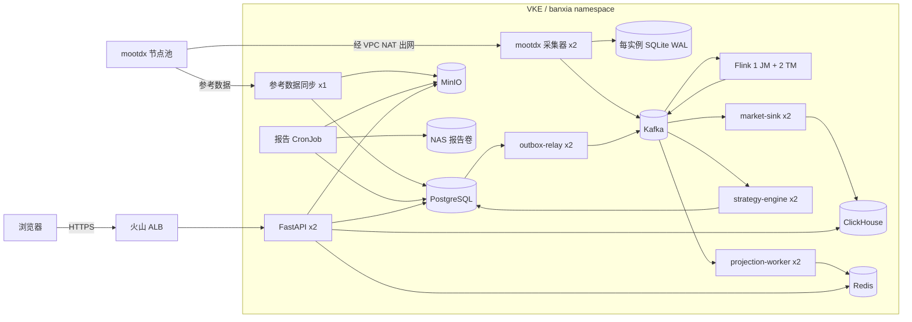

# 当前生产技术方案

## 1. 文档范围

本文描述 `2026-10-01` 已部署并运行的生产方案，事实来源为：

- 火山引擎 VKE 集群 `cdaus2p98m08ce3b12nn0` 的只读运行状态。
- `deploy/kubernetes/overlays/volcengine/` 渲染后的 Kubernetes 清单。
- `src/banxia_strategy/` 中的生产服务实现和事件契约。
- 上线提交 `901e063`；当前应用镜像标签为 `59f59a6`。

生产入口为 <https://shanao.asia>。系统只提供行情研究、策略筛选、盘中监控和报告，
不连接券商、不读取交易账户、不自动下单。

## 2. 方案概览

当前采用火山引擎 VKE 托管 Kubernetes 集群。应用服务以 Deployment 或 StatefulSet
运行，数据服务以单副本 StatefulSet 运行在同一集群，使用 EBS 云盘持久化；报告目录使用
NAS RWX 卷。公网流量由 ALB 终止 HTTPS 后转发到 FastAPI。

当前方案的核心取舍是：应用层保留多副本、消息解耦和持久 WAL，数据层先采用单副本
StatefulSet 控制成本。EBS `Retain` 可以避免 Pod 或 StatefulSet 删除时自动删除数据卷，
但不能替代数据库级复制和经过验证的备份。

## 3. 生产组件

### 3.1 对外入口

| 组件 | 当前配置 | 职责 |
| --- | --- | --- |
| DNS | `shanao.asia` | 指向 ALB 公网地址 |
| ALB | HTTP 80、HTTPS 443 | 证书中心证书、HTTP 跳转 HTTPS、TLS 终止 |
| Ingress | `banxia-alb` | 将 `/` 转发到 `api:80` |
| API Service | `80 -> 8765` | 集群内负载均衡 |
| API Deployment | 2 副本，HPA 2~6 | Web 页面、`/api/v1`、SSE、健康检查和指标 |

外部只暴露 ALB。PostgreSQL、Kafka、ClickHouse、Redis、MinIO 和 Flink 控制面均使用
集群内 Service，不直接提供公网入口。

### 3.2 应用和计算服务

| 工作负载 | 副本 | 主要职责 |
| --- | ---: | --- |
| `market-collector` | 2 | 复用 mootdx 连接；通过 PostgreSQL advisory lease 选主；采集并可靠发布行情 |
| `market-reference-sync` | 1 | 16:20 同步证券目录、板块和每日参考快照，原始数据归档后事务发布 |
| `market-sink` | 2 | 消费行情和特征事件，写入 ClickHouse 后提交 Kafka offset |
| `strategy-engine` | 2 | 消费计划、行情和特征，执行多策略状态机并事务写 PostgreSQL |
| `outbox-relay` | 2 | 领取 PostgreSQL Outbox，发布策略决策和报告事件 |
| `projection-worker` | 2 | 将 Kafka 行情、特征和决策构建为 Redis 查询投影 |
| `flink-jobmanager` | 1 | Flink 作业控制面 |
| `flink-taskmanager` | 2 | 执行 1 秒板块窗口和分钟量比计算 |
| `report-worker-1630` | CronJob | 工作日 16:30 生成初版报告 |
| `report-worker-2330` | CronJob | 工作日 23:30 基于完整日线覆盖更新 |

采集器运行两个副本，但只有取得 advisory lease 的副本请求 mootdx。两个副本各自拥有独立
10Gi EBS WAL 卷；主实例故障后，备用实例接管采集，新主使用自己的 WAL，不共享旧主未确认
事件，因此旧主卷必须保留用于恢复和审计。

### 3.3 数据服务

| 服务 | 版本 | 副本 | EBS | 数据职责 |
| --- | --- | ---: | ---: | --- |
| PostgreSQL | 16.4 | 1 | 20Gi | 策略、计划、状态机、Inbox/Outbox、任务、用户和主数据 |
| Kafka | 3.9.0 KRaft | 1 | 20Gi | 实时事件总线和短期重放 |
| ClickHouse | 24.8 | 1 | 40Gi | 高频行情、分钟线、实时特征和历史 K 线 |
| Redis | 7.4.1 AOF | 1 | 10Gi | 最新行情、特征、决策和 SSE 短期投影 |
| MinIO | 2024-09-22 | 1 | 30Gi | 原始参考数据、报告、审计和 Flink 状态对象 |

另有：

- `banxia-reports`：10Gi NAS RWX，供 API、策略引擎和报告任务共享文件结果。
- `wal-market-collector-{0,1}`：每个 10Gi EBS RWO。
- 所有 EBS/NAS StorageClass 均使用 `Retain` 回收策略。

## 4. 实时行情与决策链路

### 4.1 采集和可靠发布

1. `market-collector` 从 PostgreSQL 读取所有有效监控计划及候选股票。
2. 两个采集 Pod 使用固定 lease key 竞争 Leader；Standby 不访问 mootdx。
3. Leader 通过 mootdx 长连接批量请求候选股票。交易时段目标周期为 1 秒，非交易时段为
   60 秒；交易日历不可用时停止采集。
4. 采集器规范化盘口字段，生成稳定 `event_id`，并产生：
   `market.quote.snapshot.v1` 和去重后的 `market.bar.1m.v1`。
5. 每条事件先写本实例 SQLite WAL，再发送 Kafka；收到 Broker 确认后才从 WAL 删除。
6. Kafka 不可用时事件留在 WAL，下一轮先重放。WAL 达到容量上限时拒绝新事件，不覆盖旧数据。

事件同时保存 `source_time`、`collected_at` 和 `published_at`，用于识别行情源时间、采集延迟
和消息发布延迟。策略不能用服务接收时间冒充盘口时间。

### 4.2 分流和实时计算

Kafka 以股票代码作为行情类 Topic 的消息 Key，单只股票在同一分区内保持顺序。原始事件分为
三条消费路径：

1. `market-sink` 写入 ClickHouse，成功后同步提交 Kafka offset。
2. Flink 对盘口做 1 秒滚动窗口，计算题材样本数和上涨家数比例；对一分钟线计算最近 5 根
   基线的分钟量比，结果发布为 `market.feature.realtime.v1`。
3. `strategy-engine` 消费盘口、实时特征和策略计划，驱动每个 `plan_id + symbol`
   独立状态机。

Flink Topic Sink 使用 exactly-once 事务和 10 秒 Checkpoint；系统整体仍定义为
“至少一次投递 + 幂等写入”，因为 mootdx、Kafka 消费、PostgreSQL 和 ClickHouse 之间不存在
单一分布式事务。

### 4.3 策略状态事务

策略引擎先缓存同股票最新特征，再用盘口执行：

- 开盘和竞价区间校验。
- 跌破昨收、开盘过高和超过 10:00 等不可逆放弃规则。
- 行情时效校验。
- 板块样本量和上涨比例确认。
- 同一行情同时驱动多份有效策略计划。

一次状态变化在同一个 PostgreSQL 事务内完成：

1. 以源 `event_id` 登记 `inbox_event`。
2. 锁定并更新 `decision_state`。
3. 追加 `decision_event`。
4. 写入 `outbox_event`。
5. 事务提交后，策略引擎才提交 Kafka offset。

重复事件命中 Inbox 唯一键后幂等结束。`outbox-relay` 独立发布
`strategy.decision.v1`，Kafka 确认后再标记 Outbox 已发布，避免数据库已提交但事件丢失。

### 4.4 查询投影

`projection-worker` 消费以下事件并写 Redis：

- 最新盘口：TTL 2 天。
- 一分钟线和实时特征：TTL 2 天。
- 最新策略决策：TTL 7 天。
- 监控事件流：TTL 2 天。

API 查询最新状态时优先使用 Redis，历史行情读 ClickHouse，策略和审计读 PostgreSQL，
报告资产读 MinIO 或 NAS。Redis 不是事实来源；丢失后可由 Kafka、PostgreSQL 和 ClickHouse
重建。

## 5. 日终与参考数据链路

### 5.1 16:20 参考数据同步

`market-reference-sync` 每个工作日 16:20 执行：

1. 从 mootdx 获取证券目录、当日收盘快照和四类板块文件。
2. 规范化数据并计算 SHA-256。
3. 先将原始文件写入 MinIO `market-raw`。
4. 校验记录数、字段和完整性。
5. 在 PostgreSQL 事务中发布证券、板块成员和每日快照的新版本。
6. 更新 `source_sync_state` 的已发布快照指针。

任一步失败都不切换当前快照，API 继续读取上一次完整发布的数据，并暴露过期状态。

### 5.2 16:30 与 23:30 策略报告

报告 CronJob 的流程为：

1. Worker 使用 mootdx 交易日历确认当天是否交易日。
2. 开始执行时读取当前激活策略，不在排队时冻结旧配置。
3. 获取涨停池、炸板池、板块关系和历史行情。
4. 按一进二规则执行静态准入、评分、题材确认、行业限额和组合约束。
5. 将策略版本、运行、候选、次日计划和逐日投影事务写入 PostgreSQL。
6. 将 Markdown、JSON、CSV 上传 MinIO，并同步写 NAS 报告目录。
7. PostgreSQL Outbox 产生 `strategy.plan.created.v1` 和
   `report.generated.v1`，通知策略引擎刷新计划。

16:30 是初版，23:30 使用更完整的收盘数据覆盖更新。唯一键
`(trade_date, strategy_version_id)`、任务状态和内容哈希共同保证重试幂等。

## 6. Kafka 事件和保留

| Topic | 分区 | 保留 | 生产者 | 主要消费者 |
| --- | ---: | ---: | --- | --- |
| `market.quote.snapshot.v1` | 12 | 7 天 | 采集器 | Flink、行情 Sink、策略引擎、Redis 投影 |
| `market.bar.1m.v1` | 12 | 14 天 | 采集器 | Flink、行情 Sink、Redis 投影 |
| `market.feature.realtime.v1` | 12 | 7 天 | Flink | 行情 Sink、策略引擎、Redis 投影 |
| `strategy.plan.created.v1` | 3 | 30 天 | PostgreSQL Outbox | 策略引擎 |
| `strategy.decision.v1` | 12 | 30 天 | Outbox Relay | Redis 投影和审计链路 |
| `strategy.audit.v1` | 12 | 90 天 | Outbox Relay | 审计归档 |
| `report.generated.v1` | 3 | 30 天 | Outbox Relay | 报告通知和索引 |

每个业务 Topic 都创建对应 `.dlq`，保留 90 天。当前 Kafka 为单 Broker，所以复制因子为 1。
Topic 保留用于短期重放，不是长期备份。

## 7. 数据归属和一致性

| 数据 | 权威存储 | 加速或副本 | 一致性方式 |
| --- | --- | --- | --- |
| 原始盘口、分钟线、实时特征 | ClickHouse | Kafka、Redis | 稳定事件 ID、ReplacingMergeTree |
| 策略定义、版本、计划和候选 | PostgreSQL | MinIO 报告 | 事务、唯一键、不可变参数 |
| 当前策略状态和决策历史 | PostgreSQL | Kafka、Redis | Inbox/Outbox、乐观锁 |
| 证券目录、板块和每日快照 | PostgreSQL | MinIO 原始对象 | 先对象归档、后事务发布 |
| 最新监控查询 | Redis 投影 | PostgreSQL、ClickHouse | TTL、可重建 |
| 报告和研究文件 | MinIO | NAS、PostgreSQL 元数据 | 内容哈希 |
| Flink Checkpoint/Savepoint | MinIO `flink-state` | 无 | Flink Checkpoint |
| 采集待发布事件 | 每 Pod SQLite WAL | Kafka | 先 WAL、后 Broker ACK |

系统按“至少一次 + 幂等”设计。ClickHouse 的 `ReplacingMergeTree` 去重为最终收敛语义，
查询最新值使用 `argMax` 等方式，不在高频请求中依赖 `FINAL`。

## 8. 部署、迁移和发布

生产清单使用 Kustomize：

- `deploy/kubernetes/base/`：云厂商无关的应用基线。
- `deploy/kubernetes/overlays/volcengine/`：VKE、EBS、NAS、ALB 和集群内数据服务。

首次部署顺序：

1. 创建 Namespace、Secret、StorageClass 和数据 StatefulSet。
2. 恢复 PostgreSQL、Redis、Kafka、ClickHouse 和 MinIO 生产数据。
3. 运行 PostgreSQL/ClickHouse Migration Job。
4. 运行 Kafka Topic、MinIO Bucket 和策略目录 Bootstrap Job。
5. 启动 Flink 并提交实时特征作业。
6. 启动采集、消费者、API 和报告 CronJob。
7. 验证工作负载、数据数量、Flink 作业、HTTPS 和页面。
8. DNS 切换到 ALB。

应用镜像必须使用 Git Commit 标签，禁止 `latest`。当前运行镜像为 `59f59a6`，
生产部署清单最终化提交为 `901e063`。

## 9. 网络、安全和隔离

- VKE Worker 通过 NAT 出网访问 mootdx，行情节点不需要访问集群。
- ALB 是唯一公网入口，并在 443 终止 TLS。
- Namespace 默认拒绝入站，仅放行 API、数据服务、Flink 控制面和指标端口。
- 数据库、Redis、对象存储和镜像凭证来自 Kubernetes Secret，不进入 ConfigMap 或 Git。
- Pod 禁止提权并移除 Linux capabilities；应用 ServiceAccount 不自动挂载 Token。
- API Liveness 只判断进程存活，Readiness 检查处理请求所需依赖。

## 10. 可观测性和运行状态

应用 Worker 暴露 `9100` 指标，Flink 暴露 `9249`。仓库提供可选
ServiceMonitor/PodMonitor，需集群安装 Prometheus Operator 后单独应用。

`2026-10-01` 上线核对结果：

- 21 个常驻工作负载 Pod 全部 Ready，重启次数为 0。
- Schema、Kafka、MinIO、策略目录和 Flink 提交 Job 全部完成。
- PostgreSQL、Redis、Kafka、ClickHouse、MinIO 数据迁移完成。
- Flink 作业 `banxia-realtime-features-v1` 为 `RUNNING`，24/24 个任务处于运行状态。
- 生产入口 <https://shanao.asia> 可用。

## 11. 当前风险与演进方向

当前成本优先方案存在明确单点：

- PostgreSQL、Kafka、ClickHouse、Redis、MinIO 和 Flink JobManager 均为单副本。
- EBS `Retain` 只能保护卷不被级联删除，不能防止可用区、卷损坏或数据库逻辑损坏。
- Kafka 复制因子为 1，Broker 故障期间实时链路停止。
- MinIO 单实例不是高可用对象存储。
- Flink Checkpoint 与业务对象位于同一个单实例 MinIO。

后续生产增强按优先级推进：

1. 建立并自动验证 PostgreSQL、ClickHouse、MinIO/EBS 备份恢复。
2. 将 PostgreSQL、Redis、Kafka 和对象存储迁移到火山引擎托管高可用服务。
3. 为 ClickHouse 配置副本和 Keeper，或迁移到 ByteHouse。
4. 为 Flink 配置高可用 JobManager，并将 Checkpoint 迁移到 TOS。
5. 完整接入 Prometheus 告警、日志和追踪。
6. 完成节点驱逐、可用区故障、Kafka 重放和 Redis 全量重建演练。

上述增强不改变数据契约和应用服务边界，主要替换数据服务端点与存储实现。
