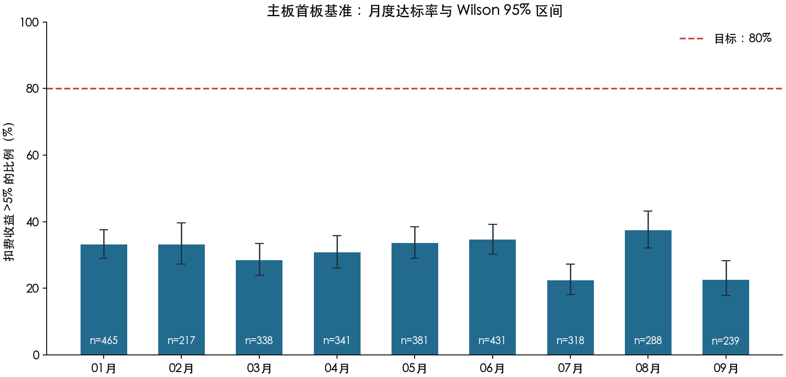
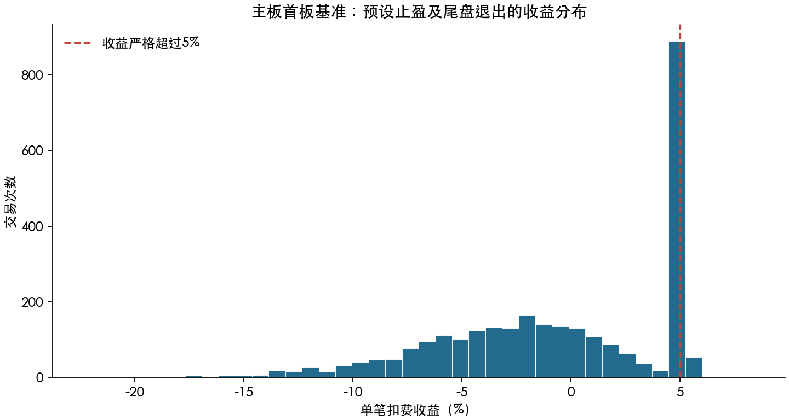
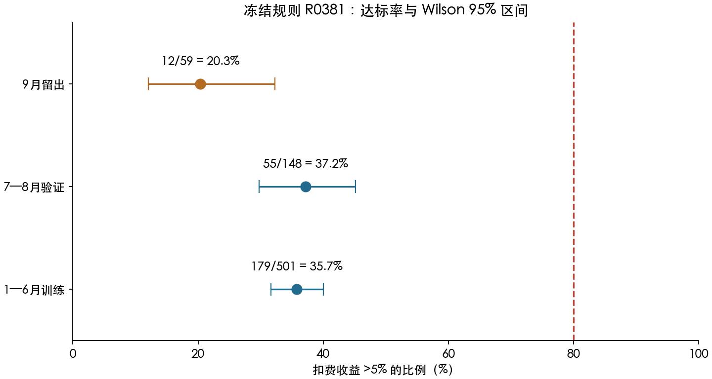

# 2026 年涨停后隔日交易复盘

统计截至 2026-09-30；生成日期：2026-10-02。

## 摘要

**本次结果不支持“第二天 10 点前买入、第三天卖出、扣费收益超过 5%，成功率超过 80%”。** 在主板首板且成交额不低于 2 亿元的样本中，固定早盘买点产生 3,018 次买入代理事件；第三天按预设止盈、未触发则尾盘退出，937 次达标，比例为 **31.05%**。

用 1—6 月训练、7—8 月验证选出的规则 R0381，在 9 月本次留出期只有 **12/59 = 20.34%** 达标，Wilson 95% 区间为 **12.04%—32.27%**。其中 57 次确认了模型卖出，平均净收益 **-2.13%**；另外 2 次未按计划卖出，仍计入失败。它不具备本次目标要求的实盘依据。

复盘并非没有成功股票：主板首板范围内，三种固定买点与两种退出模型的事后成功并集有 **988 次股票日期事件、660 只股票**。这些是复盘清单，不能把事后并集当成事前可选择的策略收益。

完整交付：[中文 Excel](assets/t1-2026/2026涨停隔日交易复盘.xlsx)、[达标股票明细 CSV](assets/t1-2026/达标股票明细.csv)、[冻结规则全部样本](assets/t1-2026/selected-trades.csv)、[本地全部事件](../research/limit-up-t1-2026/all-events.csv)、[复现方法](t1-research-method.md)。

## 1. 范围与成交证据

| 项目 | 核验结果 |
| --- | ---: |
| 2026 年已覆盖市场交易日 | 181 |
| PostgreSQL 今年涨停档案原始记录 | 15,977 |
| 排除未核实 5% 候选后事件 | 13,234 |
| 其中沪深主板 / 创业板 / 科创板 | 11,763 / 1,021 / 450 |
| 具备完整 D1、D2、D3 市场日期的事件 | 13,122 |
| 尚未走完三天，单独列出的事件 | 112 |
| 相关股票日线及除权资料 | 3,244 只 |
| 取得的相关股票日分时文件 | 23,841 |
| D2 有日线、分时一致且无当日除权干扰 | 13,037 次事件 |
| D2 公司行动导致本版本不可计量 | 52 |
| D2 缺少个股日线 | 33 |
| 主板首板且 D1 成交额 ≥2 亿元 | 7,482；其中 7,429 已走完三天 |

D1 为收盘涨停日，D2、D3 按市场实际交易日顺延。最后可完整复盘的 D1 是 9 月 28 日，最后 D2、D3 分别是 9 月 29、30 日。股票停牌不改变这个定义，不能把更晚复牌后的卖出冒充第三天卖出。[1]

每份用于判断的分时都核对了 240 个采样、收盘价格、日内价格范围和成交量合计。D2 数据一致性通过的 13,037 个事件中，D3 有 13,017 个具备一致的日线及分时，其余 20 个缺少该市场交易日的个股日线。缺少日线的原因不能仅凭这一字段认定为停牌。

成交模型按每笔 **1 万元预算**、事前计算数量、买卖各 **0.1% 滑点**、双边佣金万三且单边最低 5 元、双边过户费十万分之一和卖出印花税万五计算。买入先观察信号，下一分钟才允许出现成交证据；委托量不得超过该分钟成交量的 1%，涨停价买入不算可成交，10:00 及以后不买。[2]

**这些条件能证明历史上出现过相应价格和成交量，不能证明个人委托一定成交。** mootdx 历史分钟和分笔没有个人订单、队列位置或完整盘口。模型的 +9% 是最高可接受价格，实际下单还要满足有效申报价格范围；分钟数据不能验证当时的最优买卖价。因此本报告称为“成交代理”，不把回放当成真实券商成交回报。

分时按分钟结束时刻标记。例如表中 09:32 对应 09:31 这一分钟，已经严格早于 10:00。分笔核验发现首分钟成交量含集合竞价，本次成交判断排除了该混量分钟。另核对科创板至少 200 股申报要求；这项修正只影响补充板块统计，主板规则及各阶段结果逐项保持一致。[2][4]

## 2. 满足收益条件的股票

全部沪深股票按本次三种固定买点、两种退出模型统计，成功并集为 **1,654 次股票日期事件、981 只股票**，对应 3,012 行含不同买点的明细，均已列入 Excel 和 CSV。下文策略筛选继续聚焦主板首板且成交额不少于 2 亿元的范围。

同一股票在不同 D1 日期算不同事件。以下采用统一的 early 买点与 target 退出，按每个月**第一个达标事件**取例，避免只列涨幅最大的股票。这九例及另三例亏损样本，均已补取买卖日历史分笔，相关分钟内符合价格要求的实际成交量足以支持假定委托不超过 1% 的容量条件。[3]

| 股票 | D1 涨停日 | D2 买入日／分钟结束 | 模型买价 | D3 卖出日／分钟结束 | 模型卖价 | 净收益 |
| --- | --- | --- | ---: | --- | ---: | ---: |
| 000426 兴业银锡 | 01-05 | 01-06 09:32 | 40.16 | 01-07 09:39 | 42.29 | 5.12% |
| 600330 天通股份 | 01-30 | 02-02 09:32 | 13.77 | 02-03 09:32 | 14.50 | 5.12% |
| 000510 新金路 | 02-27 | 03-02 09:32 | 21.73 | 03-03 09:32 | 22.88 | 5.12% |
| 000070 特发信息 | 03-31 | 04-01 09:32 | 18.99 | 04-02 10:55 | 19.99 | 5.10% |
| 002149 西部材料 | 04-30 | 05-06 09:32 | 67.69 | 05-07 09:33 | 71.29 | 5.11% |
| 000037 深南电A | 05-29 | 06-01 09:32 | 11.88 | 06-02 11:15 | 12.51 | 5.12% |
| 000620 盈新发展 | 06-30 | 07-01 09:32 | 3.60 | 07-02 09:35 | 3.79 | 5.11% |
| 000815 美利云 | 07-31 | 08-03 09:32 | 16.01 | 08-04 09:32 | 16.86 | 5.15% |
| 001330 博纳影业 | 08-31 | 09-01 09:32 | 5.69 | 09-02 09:32 | 5.99 | 5.11% |

表中的收益接近 5.1%，因为卖点是交易前计算的净收益止盈价，向上取整到分；没有把第三天最高价当作成交价。比如兴业银锡买入 200 股，模型买价 40.16 元；第三天以 42.29 元退出，扣除规定费用后净收益 5.12%。对应买入分笔分钟内，价格符合条件的实际成交量为 18,557 手，卖出分钟为 4,021 手，远高于这笔假定委托的容量要求。

相同买卖流程也出现了明确亏损：广济药业 1 月 6 日 09:33 买入、1 月 7 日尾盘退出，净收益 **-6.50%**；爱丽家居同期为 **-5.77%**。两例也通过了分笔价格和容量核验。可买入与能赚到 5% 是两个独立条件，成功例证不能代替失败样本的统计。

主板首板 early＋target 的 937 次达标事件涉及 633 只股票。扩展到三种固定买点、两种退出方式的事后并集，才得到前述 988 次、660 只。CSV 和 Excel 保留买点字段，不能把重复行直接当成去重事件数。名称及行业使用当前 mootdx 分类，不代表当时名称或历史题材。

## 3. 固定买点下的总体结果

下表的分母都是相同的 **3,018 次主板首板 early 买入代理事件**，收益目标严格大于 5%。没有确认第三天退出的事件保留在分母。

| 第三天卖法 | 达标次数 | 达标率 | 已知卖出平均净收益 | 未知或未按模型卖出 |
| --- | ---: | ---: | ---: | ---: |
| 日线开盘基准，未核验集合竞价成交 | 374 | 12.39% | -0.89% | 10 |
| 首分钟后发单，等待可成交分钟 | 413 | 13.68% | -0.73% | 22 |
| 预设净收益 5.1% 止盈，未触发则尾盘退出 | 937 | **31.05%** | **-0.61%** | **138** |
| 事后第三天最高价边界，不能作为卖法 | 1,040 | 34.46% | 不作为策略收益 | 10 |

止盈方案的 138 个未知或未卖出事件中，128 个缺少尾盘满足跌停价外及容量条件的成交窗口，3 个缺 D3 日线，7 个涉及 D3 公司行动。均没有从成功率分母删除。表中平均收益仅覆盖已知卖出，不能据此计算完整账户收益、回撤或未平仓损失。

| D2 月份 | 买入次数 | 达标次数 | 达标率 |
| --- | ---: | ---: | ---: |
| 1 月 | 465 | 154 | 33.12% |
| 2 月 | 217 | 72 | 33.18% |
| 3 月 | 338 | 96 | 28.40% |
| 4 月 | 341 | 105 | 30.79% |
| 5 月 | 381 | 128 | 33.60% |
| 6 月 | 431 | 149 | 34.57% |
| 7 月 | 318 | 71 | 22.33% |
| 8 月 | 288 | 108 | 37.50% |
| 9 月 | 239 | 54 | 22.59% |

在相同早盘买点下，即使使用事后 D3 最高价作边界，也只有 34.46% 达到目标。这说明本样本的主要困难已经出现在买入后的价格路径上，不能仅靠把第三天卖点选得更漂亮解决。预设止盈使达标率高于开盘退出，但已知卖出的平均净收益仍为负；收益分布中的亏损尾部没有被约 5.1% 的止盈覆盖。7 月及 9 月的下降也表明，前几个月的命中率不能直接外推。

## 4. 哪些参数有区别

以下仅使用**训练与验证阶段**，按同一主板首板 early＋target 流程分组，跨阶段边界的交易已剔除。它们是描述性比较，不是把多个优势区间任意拼成新策略后的验证结果。[1]

| 参数 | 分组 | 买入次数 | 达标次数 | 达标率 |
| --- | --- | ---: | ---: | ---: |
| D2 开盘涨幅 | 0%—不足 1% | 585 | 163 | 27.86% |
| D2 开盘涨幅 | 1%—不足 3% | 1,019 | 287 | 28.16% |
| D2 开盘涨幅 | 3%—不足 5% | 675 | 243 | **36.00%** |
| D1 换手率 | 5%—不足 10% | 1,057 | 313 | 29.61% |
| D1 换手率 | 15%—不足 25% | 278 | 118 | **42.45%** |
| D1 流通市值 | 20 亿—不足 50 亿元 | 398 | 112 | 28.14% |
| D1 流通市值 | 50 亿—不足 100 亿元 | 748 | 247 | 33.02% |
| D1 总市值 | 50 亿—不足 100 亿元 | 743 | 240 | 32.30% |
| D1 总市值 | 500 亿元及以上 | 302 | 82 | 27.15% |
| D1 振幅 | 5%—不足 8% | 327 | 113 | 34.56% |
| D1 振幅 | 8%—不足 12% | 1,839 | 550 | 29.91% |
| D1 五日涨幅 | 0%—不足 10% | 979 | 261 | 26.66% |
| D1 五日涨幅 | 20%—不足 35% | 382 | 145 | 37.96% |
| D1 开盘涨幅 | 0%—不足 3% | 1,456 | 429 | 29.46% |
| D1 开盘涨幅 | 3%—不足 5% | 250 | 92 | 36.80% |
| D1 当日涨幅 | 9.9%—不足 10.1% | 2,664 | 835 | 31.34% |

当前行业分类中，至少 50 次买入的组里，石油石化为 21/51＝41.18%，传媒为 30/75＝40.00%，电子为 84/276＝30.43%，国防军工为 15/66＝22.73%。这不能解读为“当时主线已确认”：目前缺少完整的历史题材成员、同题材上涨比例及事件消息的时点快照，因此行业只作描述，未参与最终规则选择。

较高开盘强度、适度活跃换手和前期强势在部分组中对应更高比例，但这些比例离 80% 仍然很远。振幅、市值和行业的效果也没有形成统一的单调关系。五日涨幅超过 35% 的组虽有 44.12%，样本仅 68 次，而且使用未复权价格；不能据此追逐已大幅上涨股票。**这些发现支持保留待验证特征，不支持用胜者共同特征事后反推一个已证明的高成功率公式。**

总市值、流通市值、换手、振幅、D1/D2 开盘涨幅、D1 涨幅、五日涨幅、行业及股本依据都已保留在逐笔清单。全体 13,234 次事件中，51 次股本依据为当前快照估算，其余使用除权股本历史；两类不能混称为同等精度的历史财务数据。

## 5. 冻结规则与留出检验

预设网格共 1,296 个规则，1,212 个满足至少 100 次训练买入的样本门槛。按训练 Wilson 下限选出十个，再按验证 Wilson 下限选出 R0381，最后计算 9 月表现。全部网格中最高训练达标率也只有 **42/108＝38.89%**，没有达到 80% 的组合。

| 阶段 | 筛中事件 | 买入次数 | 达标次数 | 达标率 | Wilson 95% 区间 | 未按计划卖出 |
| --- | ---: | ---: | ---: | ---: | --- | ---: |
| 1—6 月训练 | 604 | 501 | 179 | 35.73% | 31.66%—40.02% | 29 |
| 7—8 月验证 | 187 | 148 | 55 | 37.16% | 29.79%—45.18% | 10 |
| 9 月本次留出 | 69 | 59 | 12 | **20.34%** | **12.04%—32.27%** | 2 |
| 全区间，仅描述，含跨阶段边界交易 | 871 | 716 | 253 | 35.34% | 31.92%—38.91% | 41 |

跨阶段边界的 8 次买入没有用于上述分阶段评价，其中 7 次达标；它们只进入全区间描述。这样避免把训练末日买入、验证首日卖出的收益同时用于两个阶段。9 月按买入交易日聚类的 95% bootstrap 区间为 **10.20%—30.30%**，仍不接近目标。若把筛中但未买成也算未完成机会，9 月整体完成比例是 12/69＝17.39%。

以下是已经检验、可以复现的 R0381 观察规则。**检验结果是否决其满足本次实盘目标，只适合作为后续模拟观察的基准。**

| 时间 | 条件及动作 |
| --- | --- |
| D1 收盘后 | 主板首板；成交额 ≥2 亿元；流通市值 ≤1,000 亿元；换手率 0%—100%。不再添加本次未经验证的行业或消息筛选 |
| D2 开盘 | 相对 D1 收盘高开 3%—5%；观察首分钟 |
| D2 10:00 前 | 首分钟结束后才允许发出买入信号；模型下一分钟起判断。价格上限为昨收 +9%，不在涨停价认定成交，股数不超过相关分钟成交量的 1% |
| 买入前取消 | 任何已观察价格低于 D1 收盘价，立即取消；预算不够最低申报数量、无容量或到 10:00 尚未成交，也取消 |
| D3 止盈 | 根据实际买价、数量和费用计算净收益至少 5.1% 的目标价，向上取整到分。目标超过当日涨停价时不能假定可成交 |
| D3 未止盈 | 14:55 发出退出指令，模型检查随后至 14:57 的可成交窗口；跌停或容量不足导致不能退出，记录未完成并计入失败 |
| 资金使用 | 回测为独立每笔 1 万元假设。改成每天只选 2—5 只、不同排序或不同仓位，会改变样本，需另做组合验证 |

实际委托还需核对当时证券状态和有效申报价格范围，+9% 保护上限不能不经检查直接作为报单价格。D2 当天新买股票受 T+1 限制，买入后下跌无法通过当日卖出止损；这也是本样本出现大额单笔亏损的现实约束。

R0381 全区间已知退出平均净收益为 -0.48%，最差为 -22.26%，且另有 41 笔未按计划退出。9 月已知退出平均净收益进一步下降至 -2.13%。即使只关注收益超过 5% 的频率，也不能忽略这些损失与未平仓状态。现有证据不足以支持把它激活为实盘策略。

## 6. 结论与后续验证边界

本次研究找到了可复核的历史成功事件，也同时保留了可买入但亏损、第三天卖不出和资料不足的事件。主板基准约三成达标，有限网格中没有出现 80% 训练达标率，冻结规则的 9 月表现进一步恶化。因此不能给出“保证 80%”的交易策略。

本次仅覆盖预定的三种非涨停排队买点，没有证明所有可能的交易方法都达不到 80%。但要继续研究，必须增加可在入场时观察并留存的证据，例如历史题材成员与强度、开盘成交结构、盘口队列与真实委托回报，再冻结新规则进行后续交易日检验。当前行业分类不能填补这些数据缺口。

本项目此前已研究过部分 2026 年日期，9 月是本次规则选择的留出，不能称作从未查看过的未来数据。网格搜索、样本存续偏差、缺失退市股票及股票同日相关性也限制了外推。所报区间是描述性不确定性区间，不是对市场未来的保证。

固定净收益 5.1% 的目标也对费用敏感：若保持成交价格不变，实际双边合计成本比假定多 0.2 个百分点，R0381 全区间严格超过 5% 的次数会从 253 降到 21，即 2.93%。这只是一项固定成交价的成本压力检查，并不代表重新调高止盈委托价后的策略结果。未来任何成本、买点、卖点、过滤条件或仓位变化，都要重新评估。

报告、清单和研究脚本已输出；没有启用新实盘规则，也没有自动下单功能。

## 7. 参考资料与可追溯文件

[1] 本项目. 2026 年 mootdx 涨停历史与逐事件回放数据集[DS]. PostgreSQL `banxia.limit_up_history`、`banxia.limit_up_history_coverage`，提取时间 2026-10-02 10:34:22（北京时间）. [统计数据摘要](assets/t1-2026/data-summary.json)，[采集清单](assets/t1-2026/collection-manifest.json)，[本地完整事件 CSV](../research/limit-up-t1-2026/all-events.csv).

[2] 本项目. 2026 年隔日交易协议及复现方法[CP/OL]. 2026-10-02. [研究协议](research/2026-limit-up-protocol.json)，[方法说明](t1-research-method.md)，[冻结选择](assets/t1-2026/frozen-selection.json)，[原 v2 选择](assets/t1-2026/original-v2-selection.json). 协议 v2 在收益回放前冻结；v3 仅补正科创板最低申报股数，原选择及结果另有留档，并验证主板结果完全一致。

[3] mootdx 历史分时与历史分笔接口. 12 个买卖日样例及时间口径核验[DS]. 2026-10-02 获取. [分笔核验表](assets/t1-2026/transaction-evidence-examples.csv)，[时间核验原始包](assets/t1-2026/source-clock-audit.json.gz).

[4] 上海证券交易所. 科创板股票交易规则投资者问答[EB/OL]. [科创板单笔申报数量及成交规则](https://edu.sse.com.cn/tib/qa/)，查阅日期 2026-10-02. 仅用于核对交易制度，股票行情与财务数据仍全部来自 mootdx。

[5] 本项目. 月度统计可视化[CP/OL]. [折线图](https://mdn.alipayobjects.com/one_clip/afts/img/m_hWSIOZJDcAAAAATAAAAAgAoEACAQFr/original)，[完整图表参数](assets/t1-2026/monthly-chart-spec.json). 报告正文采用本地生成、包含置信区间的静态图。
