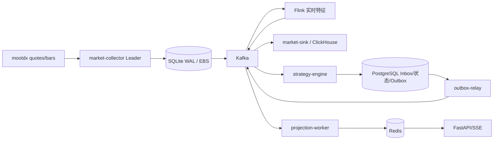
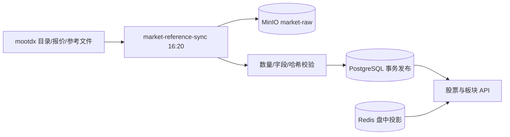

# mootdx 能力与项目使用矩阵

## 1. 文档口径

本文回答三个问题：

1. `mootdx` 能提供哪些数据。
2. 本项目实际调用了哪些能力。
3. 哪些数据已经持久化，哪些仍直接读取 mootdx，哪些只是后续设计。

当前项目依赖约束为 `mootdx>=0.11.7,<0.12`，本地验证版本为 `0.11.7`。生产镜像使用同一
依赖定义。本文基于 `mootdx 0.11.7`、其底层 `tdxpy` 解析器、项目
`MootdxProvider` 和当前数据库迁移整理。

状态定义：

- `CURRENT-PERSISTED`：生产链路已采集并写入权威存储。
- `CURRENT-DIRECT`：项目已使用，但请求时仍可能直接访问 mootdx。
- `CURRENT-DERIVED`：项目基于 mootdx 原始数据计算，不是 mootdx 原生接口。
- `TARGET`：已有数据模型或实施方案，当前尚未完整接入生产持久化。
- `UNUSED`：mootdx 提供，但本项目当前不使用。
- `UNAVAILABLE`：库中保留入口，但上游服务当前不可用。

## 2. mootdx 标准行情接口

`Quotes.factory(market="std")` 返回沪深标准行情客户端。接口完整清单如下：

| 接口 | 数据内容 | 关键输入 | 主要返回字段 | 项目状态 |
| --- | --- | --- | --- | --- |
| `traffic()` | 行情服务器流量统计 | 无 | 上下行流量统计，取决于服务端 | `UNUSED` |
| `quotes()` | 实时盘口快照 | 股票代码列表 | 现价、昨收、开高低、成交量额、内外盘、五档买卖盘、服务端时间 | `CURRENT-PERSISTED` |
| `bars()` | 股票多周期 K 线 | 代码、频率、分页位置 | OHLC、成交量、成交额、年月日时分 | `CURRENT-PERSISTED`，周期范围见下文 |
| `stock_count()` | 市场证券数量 | 沪市 `1`、深市 `0` | 整数计数 | `CURRENT-PERSISTED` 的完整性校验 |
| `stocks()` | 单市场证券目录 | 市场代码 | 代码、名称、交易单位、小数位、昨收等 | 项目使用底层分页实现，`CURRENT-PERSISTED` |
| `stock_all()` | 沪深证券目录合并 | 无 | `stocks(0)` 与 `stocks(1)` 合并结果 | `UNUSED`，项目自行分页和校验 |
| `index_bars()` | 指数 K 线 | 指数代码、频率、分页位置 | 与 K 线相同 | `CURRENT-DIRECT` |
| `index()` | 指数 K 线兼容入口 | 同上 | 与 `index_bars()` 相同 | `CURRENT-DIRECT`，用于交易日历 |
| `minute()` | 当日分时 | 股票代码 | 分钟位置价格、成交量 | `UNUSED` |
| `minutes()` | 指定日期历史分时 | 股票代码、`YYYYMMDD` | 最多约 240 个价格和成交量位置 | `CURRENT-DIRECT`，并写现有历史行情表 |
| `transaction()` | 当日分笔成交 | 代码、分页位置 | 分钟时间、价格、成交量、笔数、买卖方向 | `UNUSED` |
| `transactions()` | 历史分笔成交 | 代码、日期、分页位置 | 分钟时间、价格、成交量、买卖方向 | `TARGET` |
| `F10C()` | F10 栏目目录 | 股票代码 | 栏目名、源文件、起始位置、长度 | `CURRENT-DIRECT` |
| `F10()` | F10 栏目正文 | 股票代码、栏目名 | GBK 文本；不传栏目时返回全部栏目 | `CURRENT-DIRECT` |
| `xdxr()` | 除权除息和股本事件 | 股票代码 | 日期、事件类别、分红、配股、送转、缩股、股本变化等 | `CURRENT-DIRECT` |
| `finance()` | 当前财务摘要 | 股票代码 | 股本、资产负债、收入利润、现金流、股东人数和更新日期等 | `CURRENT-DIRECT` |
| `k()` | 按日期包装的日 K 查询 | 代码、起止日期 | 日线 DataFrame | `UNUSED` |
| `ohlc()` | `k()` 别名 | 同 `k()` | 同 `k()` | `UNUSED` |
| `block()` | 通达信板块文件解析 | 文件名 | 板块和证券成员 | 项目改用原始文件下载，`CURRENT-PERSISTED` |

### 2.1 K 线频率

mootdx/tdxpy 支持的原始频率编号为：

| 编号 | 含义 | 当前项目使用 |
| ---: | --- | --- |
| `0` | 5 分钟 | 尚未作为公开历史周期 |
| `1` | 15 分钟 | 尚未作为公开历史周期 |
| `2` | 30 分钟 | 尚未作为公开历史周期 |
| `3` | 1 小时 | 尚未作为公开历史周期 |
| `4` | 日线 | 未单独使用 |
| `5` | 周线 | 已使用 |
| `6` | 月线 | 已使用 |
| `7` | 1 分钟 | 未单独使用 |
| `8` | 1 分钟 K 线 | 盘中采集使用 |
| `9` | 日线 | 报告、研究和历史页面使用 |
| `10` | 季线 | 目标模型已预留，当前页面未开放 |
| `11` | 年线 | 已使用 |

当前 `/api/v1/stocks/{symbol}/history` 对外开放 `minute`、`day`、`week`、`month` 和
`year`。其中 `minute` 来自 `minutes()` 的分时价格位置，不是原生分钟 OHLC；现有兼容表把
单点价格映射为相同的开高低收。目标模型会将其拆到独立的 `market_minute_timeline`。

### 2.2 实时盘口字段

`quotes()` 的底层标准字段包括：

- 标识：`market`、`code`、`active1`、`active2`。
- 价格：`price`、`last_close`、`open`、`high`、`low`。
- 时间：`servertime`。
- 成交：`vol`、`cur_vol`、`amount`、`s_vol`、`b_vol`。
- 五档委托价：`bid1` 至 `bid5`、`ask1` 至 `ask5`。
- 五档委托量：`bid_vol1` 至 `bid_vol5`、`ask_vol1` 至 `ask_vol5`。
- 协议保留字段：`reversed_bytes0` 至 `reversed_bytes9`，其中
  `reversed_bytes9` 在当前解析器中标注为涨速。

项目不会把协议保留字段当作稳定业务契约。生产事件规范化为现价、开高低昨收、累计成交量额、
买一卖一及其委托量，并保留源时间、采集时间、源节点和稳定事件 ID。虽然源接口返回五档，
当前策略事件只使用一档盘口。

### 2.3 当前财务摘要字段

`finance()` 返回一只股票当前财务摘要，字段为：

```text
market, code, liutongguben, province, industry, updated_date, ipo_date,
zongguben, guojiagu, faqirenfarengu, farengu, bgu, hgu, zhigonggu,
zongzichan, liudongzichan, gudingzichan, wuxingzichan, gudongrenshu,
liudongfuzhai, changqifuzhai, zibengongjijin, jingzichan,
zhuyingshouru, zhuyinglirun, yingshouzhangkuan, yingyelirun,
touzishouyu, jingyingxianjinliu, zongxianjinliu, cunhuo,
lirunzonghe, shuihoulirun, jinglirun, weifenpeilirun,
meigujingzichan, baoliu2
```

这只是通达信当前摘要，不等同于按报告期展开的完整三大报表。当前股票详情页直接读取该接口，
尚未写入 `company_finance_snapshot`。

### 2.4 除权除息字段

`xdxr()` 返回：

```text
year, month, day, category, name, fenhong, peigujia, songzhuangu,
peigu, suogu, panqianliutong, panhouliutong, qianzongguben,
houzongguben, fenshu, xingquanjia
```

事件类别覆盖除权除息、送配股上市、股本变化、增发、回购、扩缩股和权证等。不同类别只填充
与其相关的字段，其余字段为 `null`。当前报告和涨停研究会使用这些数据，但独立公司行为版本表
仍是 `TARGET`。

## 3. 参考文件、历史财务包和本地文件

### 3.1 通达信参考文件

项目通过 mootdx 底层客户端分块下载并自行解析：

| 文件 | 内容 | 当前处理 |
| --- | --- | --- |
| `block.dat` | 默认板块 | MinIO 原始归档 + PostgreSQL 时点成员关系 |
| `block_gn.dat` | 概念板块 | MinIO 原始归档 + PostgreSQL 时点成员关系 |
| `block_fg.dat` | 风格板块 | MinIO 原始归档 + PostgreSQL 时点成员关系 |
| `block_zs.dat` | 指数板块 | MinIO 原始归档 + PostgreSQL 时点成员关系 |
| `tdxhy.cfg` | 通达信行业代码映射 | MinIO 原始归档 + PostgreSQL 时点成员关系 |

五个文件与沪深证券目录必须在同一节点、同一批次完整获取。先归档对象，再在 PostgreSQL
事务中切换当前版本；任何文件缺失都不发布半成品快照。

### 3.2 `Affair` 历史财务包

| 接口 | 能力 | 当前状态 |
| --- | --- | --- |
| `Affair.files()` | 获取 `gpcw*.zip` 文件名、MD5 和大小清单 | `TARGET` |
| `Affair.fetch()` | 下载单个或全部历史财务包 | `TARGET` |
| `Affair.parse()` | 将财务包解析为按股票、报告期的数据 | `TARGET` |

`mootdx 0.11.7` 的字段标签表包含 **581 个标签**，首列为 `report_date`。实际财务包记录宽度
和字段集合可能随通达信文件版本变化，因此不能把“581”写成固定数据库列数。目标方案保留原始
zip、`metric_schema_hash` 和完整 `metrics_json`，只将稳定且确有查询需求的指标投影为类型列。

### 3.3 `Reader` 本地通达信文件

`Reader.factory(market="std")` 可以读取本机通达信目录中的日线、1/5 分钟线、板块和自定义
板块；扩展 Reader 还可以解析扩展市场本地文件。本项目部署在 VKE，不挂载 Windows 通达信
安装目录，因此当前不使用 Reader。它是离线导入通道，不是新的数据源。

### 3.4 扩展市场

`Quotes.factory(market="ext")` 保留扩展市场行情入口，但 `mootdx 0.11.7` 源码明确提示该接口
当前失效。本项目只覆盖沪深 A 股和指数，不使用 `ExtQuotes`。

## 4. 项目调用与数据落点

| 项目能力 | mootdx 输入 | 当前调用位置 | 当前权威落点 | 状态 |
| --- | --- | --- | --- | --- |
| 实时候选盘口 | `quotes()` | `MootdxLiveSource` / `market-collector` | ClickHouse，Kafka 为短期总线 | `CURRENT-PERSISTED` |
| 一分钟 K 线 | `bars(frequency=8)` | `MootdxLiveSource` / `market-collector` | ClickHouse | `CURRENT-PERSISTED` |
| 交易日历 | `index(frequency=9)` + 休市表 | `trading_dates()` | PostgreSQL `trading_session` | `CURRENT-PERSISTED` |
| A 股证券目录 | `stock_count()` + 底层分页目录 | `reference_snapshot()` | PostgreSQL + MinIO | `CURRENT-PERSISTED` |
| 板块和行业 | 五个参考文件 | `reference_snapshot()` | PostgreSQL + MinIO | `CURRENT-PERSISTED` |
| 全市场每日快照 | `quotes()` 分批 | `market-reference-sync` | PostgreSQL + MinIO | `CURRENT-PERSISTED` |
| 日/周/月/年历史 | `bars()` | API、报告、研究任务 | ClickHouse `market_history_bar` | `CURRENT-PERSISTED` |
| 历史分时 | `minutes()` | API、回测、模拟盘 | ClickHouse 兼容历史表 | `CURRENT-PERSISTED`，模型待拆分 |
| 当前财务摘要 | `finance()` | 股票详情、策略补充 | 当前直接响应 | `CURRENT-DIRECT` |
| 除权除息 | `xdxr()` | 股票详情、涨停研究 | 部分研究结果进入 PostgreSQL | `CURRENT-DIRECT` |
| F10 目录和正文 | `F10C()`、`F10()` | 股票详情、分类补充 | 当前直接响应 | `CURRENT-DIRECT` |
| 涨停池和炸板池 | 日线、分时、财务、板块组合计算 | 报告和历史同步 | PostgreSQL、报告资产 | `CURRENT-DERIVED` |
| 指数历史 | `index()` | 交易日历和研究 | 尚无统一指数历史表 | `CURRENT-DIRECT` |
| 当日分时 | `minute()` | 无 | 无 | `UNUSED` |
| 当日/历史分笔 | `transaction()` / `transactions()` | 无 | 目标 ClickHouse 表 | `UNUSED` / `TARGET` |
| 历史财务包 | `Affair.*` | 无 | 目标 MinIO + ClickHouse | `TARGET` |
| 本地通达信文件 | `Reader` | 无 | 无 | `UNUSED` |

## 5. 四条实际数据链路

### 5.1 盘中实时链路



语义是“至少一次投递 + 幂等写入”。采集事件先入本实例 WAL，Kafka 确认后删除；策略状态、
决策历史和 Outbox 在一个 PostgreSQL 事务中提交。

### 5.2 日终参考数据链路



API 以 PostgreSQL 最近已发布快照为基线，再用 Redis 最新行情覆盖。同步失败时继续服务上一版
完整快照并暴露过期状态。

### 5.3 报告、研究和历史回填

报告和研究使用日线、历史分时、财务摘要、除权除息及板块关系构建涨停池、炸板池、策略候选和
模拟成交。结果进入 PostgreSQL，Markdown/JSON/CSV 进入 MinIO 和 NAS；通用历史 K 线按需
回填 ClickHouse。mootdx 服务端不承诺无限历史，缺口必须记录，不能把不可取得误写为空样本。

### 5.4 公司资料查询

证券身份和最近收盘数据来自 PostgreSQL/Redis；`finance()`、`xdxr()`、`F10C()` 和 `F10()`
当前仍由股票详情请求直接访问 mootdx。这是当前主要的同步外部依赖，也是持久化阶段二需要消除
的边界。

## 6. 能力限制

- mootdx 是通达信协议数据客户端，不是交易所 Level-2 数据源。
- `quotes()` 有五档快照，但没有逐笔委托队列、撤单队列和交易所序列号。
- `transactions()` 的历史时间精度为分钟，分页位置不是交易所成交序号。
- `minutes()` 是 240 个价格/成交量位置，不是完整 OHLC 分钟 K 线。
- 当前财务摘要不是完整历史报表；历史报表必须使用 `Affair` 财务包。
- F10、板块、财务内容可能被上游修订，研究必须使用观察时间和内容哈希控制可见性。
- 节点可用性和历史覆盖范围没有服务等级承诺，项目通过多节点切换、WAL、重试和已发布快照
  降低影响，但不能把它等同于交易所行情 SLA。
- 项目只把 mootdx 作为行情与公司数据源，不连接券商，不提供委托或自动下单。

## 7. 后续实施边界

按当前优先级：

1. 持久化 `finance()`、`xdxr()`、F10 目录和正文，股票详情不再同步依赖 mootdx。
2. 建立 `market_kline_v2` 和无冲突 `instrument_id`，统一股票与指数多周期历史。
3. 将历史分时从伪 OHLC 兼容表拆到 `market_minute_timeline`。
4. 按研究任务接入历史分笔，并明确分钟精度和覆盖缺口。
5. 接入 `Affair` 财务包，按原始文件、Schema 哈希和 `metrics_json` 保存。

具体表结构、发布协议和生命周期见
[mootdx 非实时数据持久化设计](11-mootdx-persistence.md)，生产运行链路见
[当前生产技术方案](13-current-production-solution.md)。
